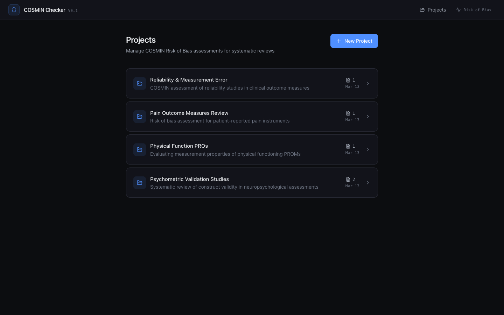
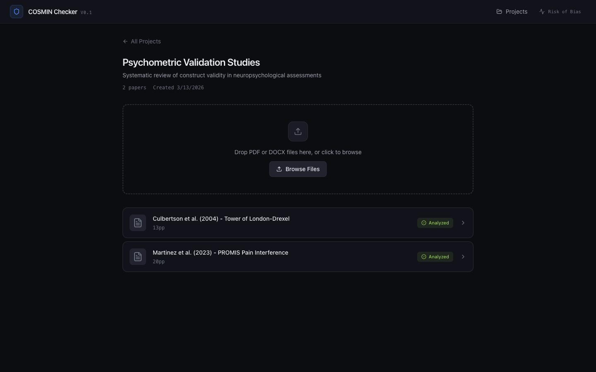
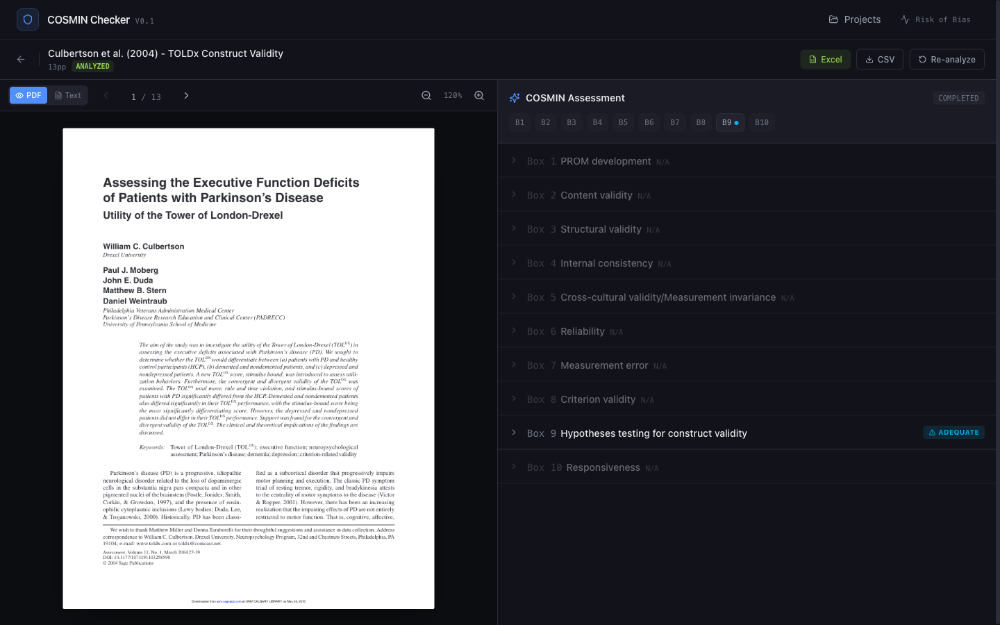
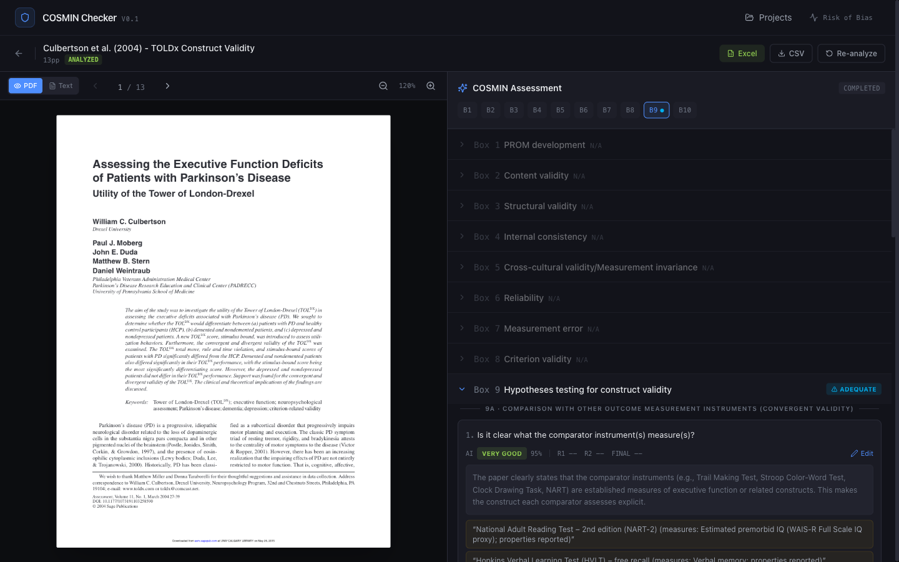
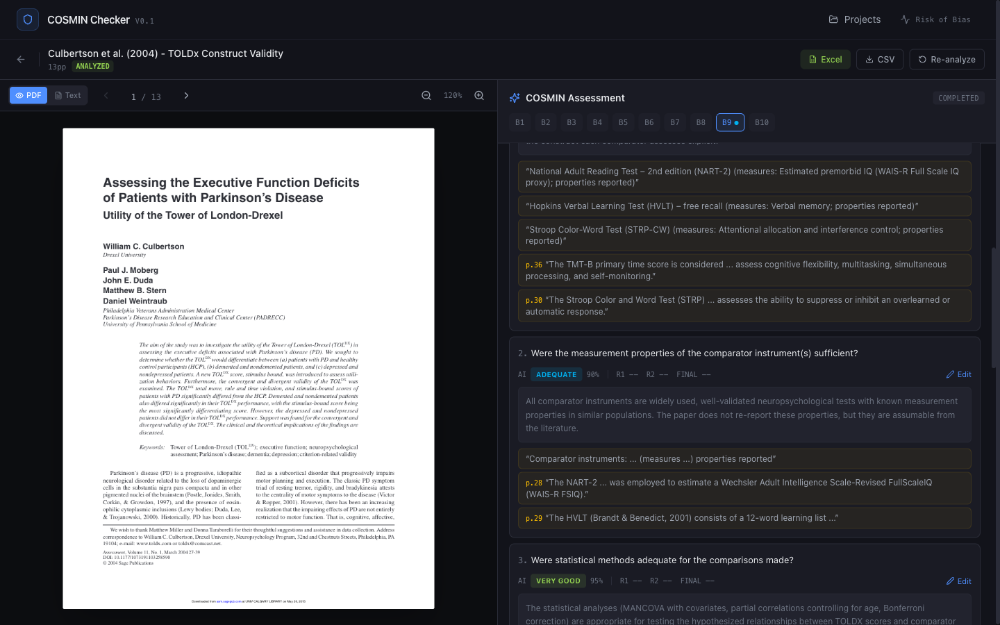

# PaperProbe

**AI-powered COSMIN Risk of Bias assessment tool for systematic reviews of outcome measurement instruments.**

PaperProbe automates the evaluation of research papers against the [COSMIN Risk of Bias checklist V3.0](https://www.cosmin.nl/tools/cosmin-risk-of-bias-tool/) using a multi-agent AI pipeline. Upload PDFs, get structured assessments across all 10 COSMIN boxes, review AI ratings with verbatim evidence quotes, and export results for your systematic review.

> **Status:** Testing / development phase. Not yet production-ready.

---

## Screenshots

### Projects Dashboard
Organize papers into systematic review projects. Track paper counts and assessment status at a glance.



### Project Detail & Upload
Upload PDFs via drag-and-drop. Papers are automatically parsed, embedded, and queued for analysis.



### Split-Panel Assessment View
PDF viewer on the left, COSMIN checklist on the right. All 10 boxes shown with relevance classification and worst-score ratings.



### AI Ratings with Evidence
Each standard is rated (Very Good / Adequate / Doubtful / Inadequate) with confidence scores, detailed reasoning, and verbatim evidence quotes with page numbers. Click a quote to navigate to the source in the PDF.



### Evidence Quotes & Reasoning
AI provides traceable reasoning for every rating decision, citing specific passages from the paper. Supports reviewer override with R1/R2/Final consensus columns.



---

## What is COSMIN?

[COSMIN](https://www.cosmin.nl/) (COnsensus-based Standards for the selection of health Measurement INstruments) provides standardized tools for evaluating the quality of studies on measurement properties. The **Risk of Bias checklist** assesses methodological quality across 10 measurement property boxes:

| Box | Measurement Property | Rating Method |
|-----|---------------------|---------------|
| 1 | PROM development | Design requirements |
| 2 | Content validity | Design requirements |
| 3 | Structural validity | Statistical methods |
| 4 | Internal consistency | Statistical methods |
| 5 | Cross-cultural validity | Statistical methods |
| 6 | Reliability | Design + Statistical |
| 7 | Measurement error | Statistical methods |
| 8 | Criterion validity | Statistical methods |
| 9 | Hypotheses testing | Design + Statistical |
| 10 | Responsiveness | Design + Statistical |

Each standard is rated: **Very Good** / **Adequate** / **Doubtful** / **Inadequate** / **N/A**

The **"worst score counts"** principle applies: the lowest-rated standard determines the overall box rating.

---

## Architecture

```
                    ┌─────────────┐
                    │   Nginx     │ :8080
                    │  (reverse   │
                    │   proxy)    │
                    └──────┬──────┘
                     /     │     \
                    /      │      \
           ┌───────┐  ┌───────┐  ┌──────────┐
           │Frontend│  │Backend│  │  Celery   │
           │Next.js │  │FastAPI│  │  Worker   │
           │  :3000 │  │ :8000 │  │          │
           └───────┘  └───┬───┘  └────┬─────┘
                          │           │
              ┌───────────┼───────────┤
              │           │           │
        ┌─────┴──┐  ┌────┴───┐  ┌───┴────┐
        │PostgreSQL│ │  Redis  │ │ Qdrant  │
        │  :5432  │  │  :6379  │ │  :6333  │
        └────────┘  └────────┘  └────────┘
```

### Tech Stack

| Component | Technology | Purpose |
|-----------|-----------|---------|
| **Frontend** | Next.js 14, Tailwind CSS, Lucide icons | Dark-mode UI with split-panel PDF + checklist view |
| **Backend** | FastAPI, SQLAlchemy, Alembic | REST API, database ORM, migrations |
| **Task Queue** | Celery + Redis | Background PDF parsing, embedding, AI analysis |
| **Database** | PostgreSQL 16 | Papers, assessments, ratings, COSMIN checklist data |
| **Vector DB** | Qdrant | Document chunk embeddings for semantic search |
| **AI** | OpenAI-compatible API | Multi-agent COSMIN evaluation pipeline |
| **Proxy** | Nginx | Reverse proxy, file upload handling |

### Multi-Agent AI Pipeline

PaperProbe uses 4 specialized AI agents that run in sequence:

```
PDF Upload → Parse → Embed → Analyze
                                 │
                    ┌────────────┼────────────┐
                    │            │            │
              ┌─────┴─────┐ ┌───┴───┐ ┌─────┴─────┐
              │ Relevance  │ │Extract│ │ Checklist  │
              │ Classifier │ │  or   │ │  Agents    │
              │            │ │       │ │(parallel)  │
              └─────┬─────┘ └───┬───┘ └─────┬─────┘
                    │           │            │
                    └────────────┼────────────┘
                                 │
                          ┌──────┴──────┐
                          │  Synthesis  │
                          │   Agent     │
                          └─────────────┘
```

1. **Relevance Classifier** — Determines which of the 10 COSMIN boxes apply to the paper
2. **Evidence Extractor** — Extracts sample sizes, statistical methods, study design, comparator instruments, and key results
3. **Checklist Agents** — Rate each standard per applicable box (run in parallel). Uses the exact decision rules from the COSMIN user manual embedded in the prompt
4. **Synthesis Agent** — Validates consistency across ratings and computes worst-score box ratings

**Key AI features:**
- Temperature 0.0 for deterministic, consistent ratings across runs
- Full paper text (up to 80k chars) sent as context — no information lost
- COSMIN manual rating rules embedded verbatim in prompts (not summarized)
- "Assumable" concept properly implemented — well-known instruments don't need properties re-reported
- Grey cell enforcement — invalid rating levels are auto-corrected
- Evidence quotes must be verbatim from the paper, never fabricated

---

## Getting Started

### Prerequisites

- Docker and Docker Compose
- An OpenAI-compatible AI API endpoint (e.g., [LM Studio](https://lmstudio.ai/), [vLLM](https://github.com/vllm-project/vllm), [Ollama](https://ollama.ai/), or OpenAI)

### Setup

1. **Clone the repository:**
   ```bash
   git clone https://github.com/1ordo/paperprobe.git
   cd paperprobe
   ```

2. **Configure environment:**
   ```bash
   cp .env.example .env
   # Edit .env and set your AI API endpoint:
   #   AI_API_BASE_URL=http://your-ai-server:1234/v1
   #   AI_MODEL_PRIMARY=your-model-name
   #   AI_MODEL_EMBEDDING=your-embedding-model
   ```

3. **Start all services:**
   ```bash
   docker compose up -d
   ```

4. **Access the application:**
   - Web UI: http://localhost:8080
   - API docs: http://localhost:8080/api/docs

### AI Model Requirements

PaperProbe works with any OpenAI-compatible API. Recommended models:

| Role | Requirement | Examples |
|------|------------|---------|
| **Primary** (checklist rating) | Large model with strong reasoning | GPT-4, Llama 3.1 70B+, Qwen 72B+ |
| **Fast** (relevance, extraction) | Medium model, good instruction following | GPT-3.5, Qwen 32B, Mistral 22B |
| **Embedding** | Text embedding model | nomic-embed-text, text-embedding-3-small |

---

## Usage

1. **Create a project** — Each project represents a systematic review
2. **Upload papers** — Drag-and-drop PDFs into the project
3. **Wait for processing** — Papers are parsed, chunked, and embedded automatically
4. **Run analysis** — Click "Run COSMIN Analysis" to trigger the AI pipeline
5. **Review ratings** — Expand boxes to see individual standard ratings with evidence
6. **Override if needed** — Use the Edit button to set Reviewer 1/2 and Final ratings
7. **Export results** — Download as Excel or CSV for your systematic review

---

## Project Structure

```
paperprobe/
├── backend/
│   ├── app/
│   │   ├── agents/          # AI agent pipeline
│   │   │   ├── base.py          # Base agent with LLM + vector search
│   │   │   ├── relevance.py     # Box relevance classifier
│   │   │   ├── extractor.py     # Evidence extractor
│   │   │   ├── checklist_agent.py  # COSMIN standard rater (core logic)
│   │   │   ├── synthesis.py     # Consistency validator
│   │   │   └── pipeline.py      # Orchestrator
│   │   ├── api/             # FastAPI route handlers
│   │   ├── models/          # SQLAlchemy ORM models
│   │   ├── schemas/         # Pydantic request/response schemas
│   │   ├── services/        # AI client, vector store, document parser
│   │   ├── workers/         # Celery background tasks
│   │   └── cosmin_data/     # COSMIN checklist seeding (all 10 boxes)
│   └── alembic/             # Database migrations
├── frontend/
│   └── src/
│       ├── app/             # Next.js 14 App Router pages
│       ├── components/      # React components (ChecklistPanel, PdfViewer, etc.)
│       ├── lib/             # API client, utilities
│       └── types/           # TypeScript type definitions
├── nginx/                   # Reverse proxy configuration
├── docs/                    # Reference documents & screenshots
├── docker-compose.yml       # Full stack orchestration
└── .env.example             # Environment variable template
```

---

## Deployment (Coolify)

PaperProbe is Docker Compose-ready. For [Coolify](https://coolify.io/) deployment:

1. Connect your GitHub repo in Coolify
2. Select "Docker Compose" as the build method
3. Set environment variables in the Coolify dashboard (copy from `.env.example`)
4. Coolify handles HTTPS, domains, and container orchestration automatically

**Required environment variables:**
- `AI_API_BASE_URL` — Your OpenAI-compatible API endpoint
- `AI_MODEL_PRIMARY` — Model for COSMIN evaluation
- `AI_MODEL_EMBEDDING` — Embedding model name
- Database/Redis/Qdrant URLs use internal Docker networking by default

---

## API Endpoints

| Method | Endpoint | Description |
|--------|----------|-------------|
| `GET` | `/api/projects` | List all projects |
| `POST` | `/api/projects` | Create a new project |
| `POST` | `/api/papers/upload` | Upload a PDF |
| `POST` | `/api/analysis/{paper_id}/run` | Trigger COSMIN analysis |
| `GET` | `/api/assessments/{paper_id}` | Get assessment with ratings |
| `PUT` | `/api/assessments/ratings/{id}` | Update reviewer ratings |
| `GET` | `/api/export/paper/{id}?format=xlsx` | Export to Excel |
| `GET` | `/api/cosmin/boxes` | Get all COSMIN boxes and standards |

Full interactive docs at `/api/docs` (Swagger UI).

---

## References

- Mokkink LB, et al. COSMIN Risk of Bias checklist for systematic reviews of Patient-Reported Outcome Measures. *Qual Life Res.* 2018;27(5):1171-9.
- Mokkink LB, et al. COSMIN Risk of Bias tool to assess the quality of studies on reliability or measurement error. *BMC Medical Research Methodology.* 2020;20(293).
- [COSMIN User Manual v4](https://www.cosmin.nl/wp-content/uploads/user-manual-COSMIN-Risk-of-Bias-tool_v4_JAN_final.pdf) — Rating methodology reference

---

## License

This project is for research and educational purposes. The COSMIN methodology and checklist are developed by the [COSMIN initiative](https://www.cosmin.nl/).
